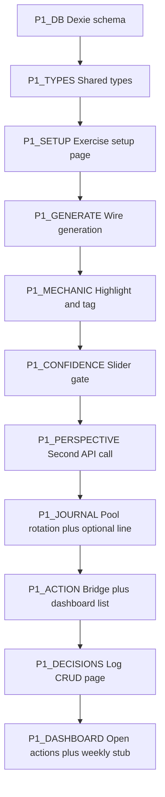

# Phase 1 - Implementation plan (Analytical MVP)

**Status:** Core MVP implemented in `web/` (exercise flow, Dexie, APIs, home/settings/decisions). Use this file for future tweaks; do not use `ai_plan.txt` as a live checklist.

**Spec reference only:** [../ai_plan.txt](../ai_plan.txt) sections **1.1–1.9** and **Phase 1 Acceptance Criteria** (do not use `ai_plan.txt` as a status checklist).

**Prereqs:** Phase 0 complete (`web/` builds; `POST /api/ai` + Zod stable; optional `npm run gate:phase0` with dev server).

**Stack additions (install when starting P1-DB):** `dexie` (IndexedDB), optional `uuid` / `crypto.randomUUID` for ids.

---

## Ordering principle

Build **data layer → exercise flow (generate → highlight → confidence → submit) → AI perspective → journal → action bridge → dashboard hooks → real decision log**. Keeps UI testable after each vertical slice.

---

## P1-DB - Dexie schema and tables

**Goal:** Persist exercises, journal entries, confidence records, action bridge, decision log per [ai_plan.txt](../ai_plan.txt) interfaces **1.8** (Exercise, UserHighlight, EmbeddedIssue shape from API, JournalEntry with `promptIds`, `aiReferenceLine`, `responses`, ActionBridge, RealDecisionLogEntry, ConfidenceRecord).

**Tasks:**

1. Define `ThinkingType`, `TagType` (include all tags from **1.2** including `valid_point`, `unclear` - align Zod/API `logical_fallacy` vs UI labels in a single mapping module).
2. Implement [`src/lib/db/schema.ts`](src/lib/db/schema.ts): Dexie `Version(1)` with stores: `exercises`, `journalEntries`, `confidenceRecords`, `actions`, `decisions` (names stable for migrations later).
3. Implement thin CRUD in [`exercises.ts`](src/lib/db/exercises.ts), [`journal.ts`](src/lib/db/journal.ts), [`actions.ts`](src/lib/db/actions.ts), [`decisions.ts`](src/lib/db/decisions.ts), [`analytics.ts`](src/lib/db/analytics.ts) (minimal queries for “last N journals by domain”, “open actions”).
4. Export `getDb()` singleton; open DB on client only (guard SSR).

**Done when:** You can create/read/update an `Exercise` row from a temporary dev-only button or unit-less client effect without errors after refresh.

---

## P1-TYPES - Align TypeScript with spec

**Goal:** Single source of truth in [`src/lib/types/exercise.ts`](src/lib/types/exercise.ts) (and `journal.ts`) matching **1.8** + API `AnalyticalExercise` from [`validators/common.ts`](src/lib/ai/validators/common.ts).

**Done when:** No duplicate conflicting interfaces; components import from `@/lib/types/*`.

---

## P1-API - Perspective generation route

**Goal:** After user submits highlights + confidence, server calls Gemini with **structured prompt** (sections from **1.4**) using exercise JSON + user highlights; returns narrative string (no numeric exercise score).

**Tasks:**

1. Add e.g. `POST /api/ai/perspective` or extend `POST /api/ai` with `mode: "perspective"` + body `{ exerciseId?, passage, embeddedIssues, userHighlights, confidenceBefore }` - pick one contract and document in code comment.
2. New prompt template file [`src/lib/ai/prompts/analytical-perspective.ts`](src/lib/ai/prompts/analytical-perspective.ts) (or section in `analytical.ts`) listing required sections: embedded recap, additional perspectives, debatable highlight callouts, acknowledgment of user-found unplanned issues.
3. Store result on `Exercise.aiPerspective` and `completedAt` when journal+action flow finishes (or when perspective step completes - choose one lifecycle; document).

**Done when:** Smoke: complete mechanic with mock highlights → API returns non-empty markdown/text and saves to IndexedDB.

---

## P1-SETUP - Exercise setup UI (**1.1**)

**Goal:** Replace placeholder [`src/app/exercise/[type]/page.tsx`](src/app/exercise/[type]/page.tsx) for `type=analytical` only (404 or message for others).

**Tasks:**

1. Dashboard [`src/app/page.tsx`](src/app/page.tsx): “Start exercise” → `/exercise/analytical` (or query param).
2. Domain dropdown: hardcode list from **Domain Configuration** in spec + “Custom” with text input.
3. “Generate exercise” → `POST /api/ai` with domain + optional settings context (read from future settings; Phase 1 can use localStorage or minimal `/settings` save first - **recommend:** implement minimal `userContext` in Dexie `settings` table early).

**Done when:** Full passage renders from `data.passage` + `data.title` on a dedicated exercise screen.

---

## P1-MECHANIC - Highlight & Tag (**1.2**)

**Goal:** Implement [`HighlightTag.tsx`](src/components/exercises/HighlightTag.tsx) + wiring.

**Tasks:**

1. Render passage as selectable text (offsets relative to raw `passage` string - normalize newlines once).
2. Toolbar: 6 tag types with colors per spec; keyboard-accessible where feasible.
3. State: `UserHighlight[]` with `startOffset`, `endOffset`, `text`, `tag`, `id`; edit/remove tag on existing highlight.
4. Optional: validate selection overlaps (merge or split - MVP: disallow overlapping selections with simple toast).

**Done when:** User can create ≥1 highlight and change tag before submit.

---

## P1-CONFIDENCE - Slider before perspective (**1.3**)

**Goal:** [`ConfidenceSlider.tsx`](src/components/shared/ConfidenceSlider.tsx) blocks “Submit” until 0–100 set; value stored in exercise state then `ConfidenceRecord` on completion pipeline.

**Done when:** Cannot open AI perspective without confidence (client guard + persisted value).

---

## P1-CALIB - `actualAccuracy` (**1.3b** analytical row only)

**Goal:** Implement pure function e.g. [`src/lib/analytics/calibration-analytical.ts`](src/lib/analytics/calibration-analytical.ts): IoU + tag match per spec table (70/30 split, decoy rules).

**Tasks:**

1. Match each `embeddedIssues[]` item to best user highlight by span IoU.
2. Compute 0–100; write `ConfidenceRecord` with `gap = confidenceBefore - actualAccuracy` when exercise completes.

**Done when:** Known fixture (synthetic highlights + issues) produces deterministic score in a small test or dev-only assert.

---

## P1-PANEL - AI perspective UI (**1.4**)

**Goal:** [`AIPerspective.tsx`](src/components/shared/AIPerspective.tsx) renders sections (headings + prose); no “score /10”.

**Done when:** Matches tone requirement; content from stored `aiPerspective` string or structured JSON if you split server response (prefer one stored blob for Phase 1 simplicity).

---

## P1-JOURNAL - Mandatory journal (**1.5**)

**Goal:** [`journal-pool.ts`](src/lib/ai/prompts/journal-pool.ts): ≥12 prompts with stable `id`; rotation excludes ids used in last **5** completed exercises (query Dexie).

**Tasks:**

1. Pick 3 random prompts per session per rules.
2. Optional AI reference line: small `POST /api/ai` or dedicated route with **last 2–3** journal text blobs same domain, max tokens; if none, skip call.
3. Validation: ≥2 prompts with `length > 10` before “Continue” to Action Bridge.
4. Persist `JournalEntry` with `promptIds`, `aiReferenceLine`, `responses`.

**Done when:** Cannot finish exercise without valid journal; refresh preserves partial state only if you explicitly want draft saves (optional).

---

## P1-ACTION - Action bridge (**1.6**)

**Goal:** Single required field ≥15 chars; save `ActionBridge` linked to `exerciseId`; dashboard lists open items.

**Tasks:**

1. [`src/app/page.tsx`](src/app/page.tsx) or new `src/app/dashboard/page.tsx`: list open actions (title + date + one line).
2. Weekly follow-through: minimal “weekKey” (ISO week) + yes/no stored on `ActionBridge.weeklyFollowThrough` - UI can be a small card on home (non-blocking per spec tone).

**Done when:** One atomic Dexie transaction writes exercise completion + journal + action (use `db.transaction`).

---

## P1-DECISIONS - Real decision log (**1.7**)

**Goal:** [`src/app/decisions/page.tsx`](src/app/decisions/page.tsx): form add/list/edit `followUpNote`; fields per **1.7**; optional `linkedExerciseId` picker (dropdown from recent exercises).

**Done when:** CRUD round-trip in IndexedDB; survives refresh.

---

## P1-SHELL - Exercise wrapper (**1.x UX**)

**Goal:** [`ExerciseShell.tsx`](src/components/shared/ExerciseShell.tsx): step progress (Setup → Read/tag → Confidence → Submit → Perspective → Journal → Action → Done), titles in English.

---

## P1-QA - Acceptance vs spec

Checklist (track **here** or in PR description, not in `ai_plan.txt`):

- [x] Generate → highlight/tag → confidence → submit → perspective → journal (2/3 prompts) → action → persist.
- [x] `actualAccuracy` + `ConfidenceRecord` on completion.
- [x] Dashboard shows open actions + weekly follow-through UI (minimal).
- [x] Real decision log page functional.
- [x] No numeric “exercise score” on exercise screens.
- [x] `npm run build` / `npm run lint` clean.

---

## Suggested commit milestones

1. `feat(db): dexie schema + types`  
2. `feat(exercise): analytical setup + generate`  
3. `feat(exercise): highlight tag + confidence`  
4. `feat(api): analytical perspective`  
5. `feat(exercise): journal pool + action bridge + finish transaction`  
6. `feat(decisions): real decision log`  
7. `feat(home): dashboard actions + weekly stub`
