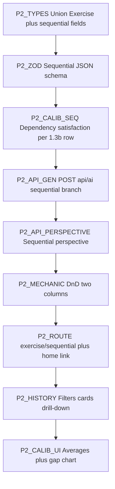

# Phase 2 — Implementation plan (Sequential + History)

**Status:** Core Phase 2 implemented in `web/` (sequential flow, APIs, history, calibration UI). Track checklist **here** only; do not use [`../ai_plan.txt`](../ai_plan.txt) as a live status board.

**Spec reference only:** [../ai_plan.txt](../ai_plan.txt) sections **2.1–2.5** and **Phase 2 Acceptance Criteria** (Sequential drag-and-drop, perspective, prompt JSON, history, calibration aggregates).

**Prereqs:** Phase 1 complete ([`PHASE1_IMPLEMENTATION.md`](PHASE1_IMPLEMENTATION.md)); `web/` builds; IndexedDB **version 1** schema unchanged (union `Exercise` is backward-compatible with existing analytical rows).

**Stack additions:** `@dnd-kit/core`, `@dnd-kit/sortable`, `@dnd-kit/utilities` (install when starting **P2-MECHANIC**).

---

## Ordering principle

Build **types + validators + sequential calibration → generate API → perspective API → DnD flow (reuse journal/action shell) → history list + read-only detail → calibration UI on history**.

---

## P2-TYPES — Discriminated `Exercise`

**Goal:** [`src/lib/types/exercise.ts`](src/lib/types/exercise.ts): `ThinkingType` includes `"sequential"`; `AnalyticalExerciseRow` and `SequentialExerciseRow` union into `Exercise`; sequential fields: `scenario`, `steps[]`, `criticalErrors[]`, `userOrderedStepIds`, shared `title`, `domain`, `confidenceBefore`, `aiPerspective`, timestamps.

**Done when:** Analytical-only code narrows with `exercise.type === "analytical"` or imports `AnalyticalExerciseRow`; Dexie `Table<Exercise>` type-checks.

---

## P2-ZOD — Sequential generation contract

**Goal:** [`src/lib/ai/validators/sequential.ts`](src/lib/ai/validators/sequential.ts) mirrors **2.3**: `steps` with `id`, `text`, `correctPosition`, `dependencies`, `isFlexible`, `explanation`; `criticalErrors` with `severity` enum; `parseSequentialExerciseJson` with fence stripping (reuse pattern from [`common.ts`](src/lib/ai/validators/common.ts)).

**Done when:** `POST /api/ai` returns `{ ok: true, data }` validated by this schema for `exerciseType: "sequential"`.

---

## P2-DB — Dexie

**Goal:** No new Dexie version required; `exercises` already indexes `type`, `completedAt` ([`schema.ts`](src/lib/db/schema.ts)). Helpers in [`exercises.ts`](src/lib/db/exercises.ts): `listCompletedExercises`, `getConfidenceRecordForExercise`, `listConfidenceRecords`.

**Done when:** Completed sequential rows survive refresh; history filters query in memory (fine for local MVP scale).

---

## P2-CALIB-SEQ — `actualAccuracy` for sequential (**1.3b**)

**Goal:** [`src/lib/analytics/calibration-sequential.ts`](src/lib/analytics/calibration-sequential.ts): % of **dependency edges** satisfied in final order (`dep` appears before `step`); edges where **both** endpoints have `isFlexible: true` excluded from numerator and denominator (per spec: flexible group swaps do not affect score).

**Done when:** Deterministic unit-style check in dev or small fixture: known DAG + order → expected %.

---

## P2-API-GEN — Sequential exercise generation

**Goal:** Extend [`src/app/api/ai/route.ts`](src/app/api/ai/route.ts): accept `exerciseType: "sequential"` (default `"analytical"` for back-compat); prompt [`src/lib/ai/prompts/sequential.ts`](src/lib/ai/prompts/sequential.ts); reuse JSON Gemini call from [`gemini.ts`](src/lib/ai/gemini.ts).

**Done when:** Smoke from `/dev/ai-smoke` or curl returns valid sequential JSON.

---

## P2-API-PERSPECTIVE — Sequential narrative

**Goal:** Extend [`src/app/api/ai/perspective/route.ts`](src/app/api/ai/perspective/route.ts) with `kind: "sequential"` body: scenario, steps, criticalErrors, `userOrderedStepIds`, `confidenceBefore`, domain, title; prompt [`src/lib/ai/prompts/sequential-perspective.ts`](src/lib/ai/prompts/sequential-perspective.ts) covering **2.2** (intended chain, divergence, critical path, wrong-position callouts — prose only, no numeric exercise score).

**Done when:** Non-empty markdown/text after a valid submission payload.

---

## P2-MECHANIC — Drag and drop (**2.1**)

**Goal:** [`src/components/exercises/SequentialExerciseFlow.tsx`](src/components/exercises/SequentialExerciseFlow.tsx): scrambled **source** pool + **target** timeline; drag pool → timeline; reorder within timeline; return to pool optional; `@dnd-kit` accessible patterns; then confidence → perspective (reuse [`ConfidenceSlider`](src/components/shared/ConfidenceSlider.tsx), [`AIPerspective`](src/components/shared/AIPerspective.tsx)).

**Done when:** Desktop smooth interaction; cannot submit order until all steps placed in timeline exactly once.

---

## P2-SHELL — Labels for sequential

**Goal:** [`ExerciseShell`](src/components/shared/ExerciseShell.tsx) accepts optional step labels; sequential uses “Order steps” instead of “Highlight & tag”.

**Done when:** `/exercise/sequential` nav labels match flow.

---

## P2-JOURNAL-ACTION — Shared with Phase 1

**Goal:** Same journal pool rules, journal-ref route, action bridge, [`completeExerciseFlow`](src/lib/db/complete-exercise.ts) as analytical; on finish, `computeSequentialAccuracy` drives `ConfidenceRecord`.

**Done when:** Acceptance: “Both exercise types share the same journal flow.”

---

## P2-HISTORY — Exercise history (**2.4**)

**Goal:** [`src/app/exercise/history/page.tsx`](src/app/exercise/history/page.tsx): list completed exercises (newest first); filters by type, domain substring, optional date range on `completedAt`; each row: type, domain, date, **confidence gap** (join `confidenceRecords`); click opens read-only detail (passage + highlights **or** scenario + ordered steps + perspective + journal text); no edit.

**Done when:** Analytical and sequential both reviewable.

---

## P2-CALIB-UI — Aggregates + chart (**2.5**)

**Goal:** On history page: across **all** completed exercises with a confidence row — average confidence, average accuracy (per-type formula already on `ConfidenceRecord`), average calibration gap; simple line chart of **gap over time** (global series; per-type chart optional stretch).

**Done when:** Numbers match recomputation from Dexie exports.

---

## P2-QA — Acceptance vs spec

Checklist (track **here**, not `ai_plan.txt`):

- [x] Sequential: generate → order (DnD) → confidence → perspective → journal (2/3 prompts) → action → persist.
- [x] `actualAccuracy` for sequential matches **1.3b** sequential row; stored on `ConfidenceRecord`.
- [x] History filters + read-only detail for both types.
- [x] Calibration averages + gap chart on history page.
- [x] No numeric “exercise score” on exercise screens.
- [x] `npm run build` / `npm run lint` clean.

---

## Suggested commit milestones

1. `feat(types): exercise union + sequential zod + calibration-sequential`  
2. `feat(api): sequential generate + perspective`  
3. `feat(exercise): sequential dnd flow + shell labels`  
4. `feat(history): completed list filters detail + calibration chart`  
