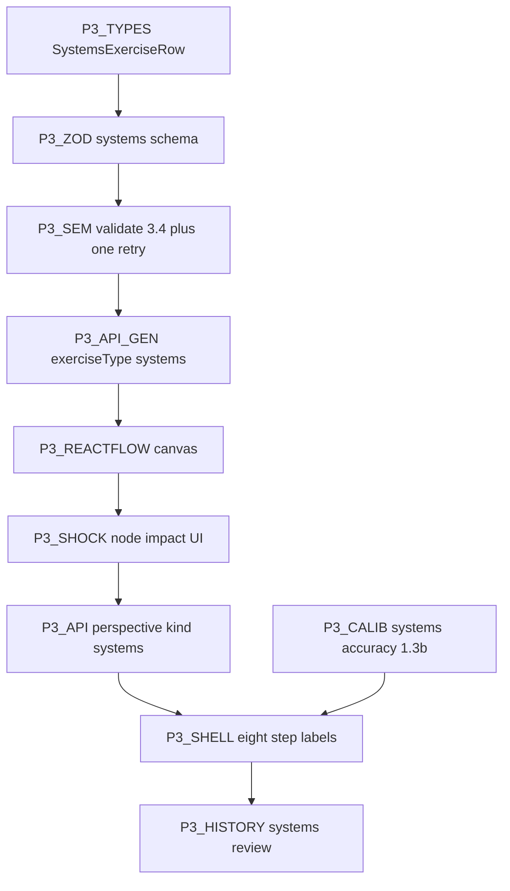

# Phase 3 - Implementation plan (Systems / Node–Connection)

**Status:** Core Phase 3 implemented in `web/` (React Flow canvas, shock phase, validation + retry, calibration, history). Track checklist **here** only; do not use [`../ai_plan.txt`](../ai_plan.txt) as a live status board.

**Spec reference only:** [../ai_plan.txt](../ai_plan.txt) sections **3.1–3.4** + **Acceptance Criteria** (~547–669) and **1.3b** Systems calibration row (~308).

**Prereqs:** Phase 1–2 complete ([`PHASE1_IMPLEMENTATION.md`](PHASE1_IMPLEMENTATION.md), [`PHASE2_IMPLEMENTATION.md`](PHASE2_IMPLEMENTATION.md)); union `Exercise` pattern established.

**Stack additions:** `@xyflow/react` + default stylesheet import on the client canvas.

---

## Ordering principle

Build **types + Zod + semantic validation (3.4) + server retry → generate API → calibration → perspective (shock compare) → React Flow UI (connect + popover + cap 20) → shock clicks → journal/action shell → history**.

---

## P3-TYPES - `systems` discriminant

**Goal:** [`src/lib/types/exercise.ts`](src/lib/types/exercise.ts): `ThinkingType` includes `"systems"`; `SystemsExerciseRow` with AI payload (`scenario`, `nodes`, `intendedConnections`, `shockEvent`), user `userEdges[]` (`id`, `source`, `target`, `type`), `nodeImpact` map (`none` | `direct` | `indirect`), shared `confidenceBefore`, `aiPerspective`, timestamps; `isSystemsExercise` helper; extend `Exercise` union.

**Done when:** History and `putExercise` accept systems rows without type errors.

---

## P3-ZOD + P3-SEM - Schema **3.3** and rules **3.4**

**Goal:** [`src/lib/ai/validators/systems.ts`](src/lib/ai/validators/systems.ts): Zod mirrors JSON (exactly 6 nodes `node_1`…`node_6`, label/description max lengths, connection `type` enum, `shockEvent` arrays); `parseSystemsExerciseJson`; **`validateSystemsExerciseSemantics`** returns `string[]`: valid `from`/`to`, no duplicate directed pair, shock affected ⊆ nodes, **pairwise node distance ≥ 15** (Euclidean on `x`,`y` percent plane).

**Done when:** Invalid AI output fails semantic check; valid fixture passes with empty errors.

---

## P3-API-GEN - Generate + one retry

**Goal:** [`src/app/api/ai/route.ts`](src/app/api/ai/route.ts): `exerciseType: "systems"`; [`src/lib/ai/prompts/systems.ts`](src/lib/ai/prompts/systems.ts); parse → semantic validate → on failure **single** second Gemini call with appended correction text per spec; second failure → `422` + user-facing message (no corrupt payload).

**Done when:** Smoke returns valid systems JSON or controlled error.

---

## P3-CALIB - `actualAccuracy` (**1.3b** Systems row)

**Goal:** [`src/lib/analytics/calibration-systems.ts`](src/lib/analytics/calibration-systems.ts): score = `%` of `intendedConnections` matched by a user edge with same `(from, to, type)` triplet (each intended edge counted once); **+10** percentage points (cap 100) if shock match: **direct** set equals AI `directlyAffected` as sets, and **Jaccard** of **indirect** sets ≥ `0.75`.

**Done when:** Documented constants at top of file; deterministic small fixture.

---

## P3-API-PERSPECTIVE - Shock comparison

**Goal:** [`src/app/api/ai/perspective/route.ts`](src/app/api/ai/perspective/route.ts) `kind: "systems"`; body: `title`, `domain`, `scenario`, `nodes`, `intendedConnections`, `shockEvent`, `userEdges`, `nodeImpact`, `confidenceBefore`, `userContext?`; prompt [`src/lib/ai/prompts/systems-shock-perspective.ts`](src/lib/ai/prompts/systems-shock-perspective.ts) - collaborative comparison of user impact map vs ripple narrative (no numeric exercise score on screen copy).

**Done when:** Non-empty text for valid POST.

---

## P3-MECHANIC - React Flow (**3.1**)

**Goal:** [`src/components/exercises/SystemsFlowCanvas.tsx`](src/components/exercises/SystemsFlowCanvas.tsx) (or inlined): `@xyflow/react` with `nodesDraggable={false}`, `nodesConnectable` only during connect step, `zoomOnScroll={false}`, `panOnDrag={false}`, `fitView`; map `%` positions to pixel layout in fixed-height container; after `onConnect` user picks edge type (inline selector, no Popover component required); max **20** edges; delete selected edge control; custom read-only node UI + shock styling by `nodeImpact`.

**Done when:** Acceptance: static canvas, popover/selector for type, edge delete, 20-cap.

---

## P3-FLOW - `SystemsExerciseFlow`

**Goal:** [`src/components/exercises/SystemsExerciseFlow.tsx`](src/components/exercises/SystemsExerciseFlow.tsx): UX order aligned with **1.3** spirit - **Confidence before AI shock narrative**: Setup → Connect → **Confidence** → Shock (mark nodes) → submit → AI reflection → Journal → Action → Done; reuse journal pool, `completeExerciseFlow`, `computeSystemsAccuracy` on finish.

**Done when:** End-to-end persist matches analytical/sequential pattern.

---

## P3-SHELL - Eight-step labels

**Goal:** [`ExerciseShell`](src/components/shared/ExerciseShell.tsx): `SYSTEMS_EXERCISE_STEP_LABELS` (8 entries: Setup, Connect, Confidence, Shock, AI reflection, Journal, Action, Done).

**Done when:** `/exercise/systems` progress matches flow indices 0–7.

---

## P3-ROUTE + home

**Goal:** [`src/app/exercise/[type]/page.tsx`](src/app/exercise/[type]/page.tsx) branch `systems`; [`HomeContent`](src/components/dashboard/HomeContent.tsx) CTA.

---

## P3-HISTORY

**Goal:** [`src/app/exercise/history/page.tsx`](src/app/exercise/history/page.tsx): filter `systems`; read-only detail lists scenario, nodes, user edges, shock selections, perspective.

---

## P3-QA - Acceptance vs spec

Checklist (here only):

- [x] React Flow renders fixed nodes; connections + type selector + delete; max 20 edges; no zoom/pan/drag nodes.
- [x] Shock phase: node click feedback; submit → AI comparison text.
- [x] Zod + semantic validation + one retry + friendly failure.
- [x] Calibration matches **1.3b** Systems row (+ documented shock bonus).
- [x] Shared journal/action completion.
- [x] History supports systems.
- [x] `npm run build` / `npm run lint` clean.

---

## Suggested commit milestones

1. `feat(types): systems exercise + validators + semantic validation + API retry`  
2. `feat(api): systems perspective kind + prompts`  
3. `feat(analytics): calibration-systems`  
4. `feat(exercise): systems react-flow flow + shell labels + route`  
5. `feat(history): systems filter and review`  
