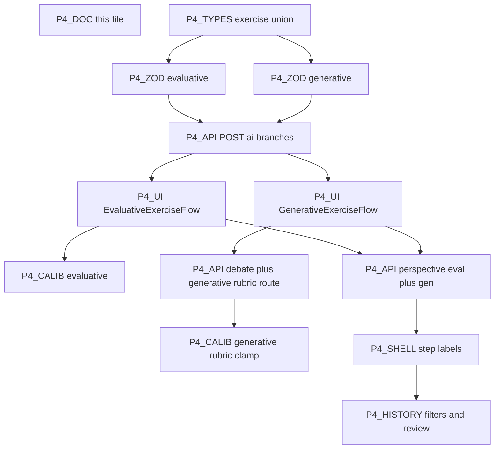

# Phase 4 — Implementation plan (Evaluative + Generative)

**Status:** Core Phase 4 implemented in `web/` (evaluative matrix/scoring, generative scaffold + debate + rubric, APIs, calibration, history). Track checklist **here** only; do not use [`../ai_plan.txt`](../ai_plan.txt) as a live status board.

**Spec reference only:** [../ai_plan.txt](../ai_plan.txt) **Phase 4** (~671–839), **Acceptance Criteria** (~831–839), **1.3b** Evaluative / Generative rows (~309–310).

**Prereqs:** Phases 1–3 ([`PHASE1_IMPLEMENTATION.md`](PHASE1_IMPLEMENTATION.md) … [`PHASE3_IMPLEMENTATION.md`](PHASE3_IMPLEMENTATION.md)); union `Exercise`; `completeExerciseFlow`.

**Stack:** `@dnd-kit/core` (already in `package.json`) for matrix drag; Gemini for generate / perspective / debate / rubric (ai_plan mentions Sonnet for some flows — we use Gemini; documented here).

**Scaffold tracking (4.3):** `generativeStage` for a new exercise is derived from **count of completed** `type === "generative"` rows in IndexedDB (`listCompletedExercises({ type: "generative" })`), not a separate counter (avoids drift).

**Debate rounds (4.2):** **Max 3** user reply turns after the opening AI challenge (each turn: user textarea → assistant response). Total assistant messages in debate: **1 opening + up to 3 follow-ups**.

---

## Ordering principle

---

## P4-TYPES — `evaluative` / `generative`

**Goal:** [`src/lib/types/exercise.ts`](src/lib/types/exercise.ts): extend `ThinkingType`; `EvaluativeExerciseRow` as `EvaluativeMatrixRow | EvaluativeScoringRow`; `GenerativeExerciseRow` with `stageAtStart`, `prompts[]`, `answers`, `draftBaseline`, debate fields, `rubricScore`, shared timestamps and `confidenceBefore` / `aiPerspective`; `isEvaluativeExercise` / `isGenerativeExercise`.

**Done when:** `putExercise` / history compile with new discriminants.

---

## P4-ZOD + P4-SEM — Evaluative (**4.1c**)

**Goal:** [`src/lib/ai/validators/evaluative.ts`](src/lib/ai/validators/evaluative.ts): discriminated `variant`; matrix: 4–6 options, quadrant enum, axis labels; scoring: ≥3 criteria, options, `suggestedScores` keys per criterion, `hiddenCriteria` ≥1; `parseEvaluativeExerciseJson`; `validateEvaluativeSemantics`; `EVALUATIVE_RETRY_SUFFIX`.

**Done when:** Invalid JSON / semantics trigger one server retry then 422.

---

## P4-ZOD + P4-SEM — Generative (**4.2**)

**Goal:** [`src/lib/ai/validators/generative.ts`](src/lib/ai/validators/generative.ts): exactly **4** prompts; per requested `generativeStage` validate presence of `draftText` (edit), `hints` length 2–3 (hint), optional `spareHint` (independent); `parseGenerativeExerciseJson`; `GENERATIVE_RETRY_SUFFIX`.

**Done when:** Same retry pattern as evaluative/systems.

---

## P4-API — `POST /api/ai`

**Goal:** [`src/app/api/ai/route.ts`](src/app/api/ai/route.ts): `exerciseType` `"evaluative"` | `"generative"`; prompts [`evaluative.ts`](src/lib/ai/prompts/evaluative.ts), [`generative.ts`](src/lib/ai/prompts/generative.ts); body for generative includes `generativeStage`.

**Done when:** Dev smoke can return both variants.

---

## P4-API — Perspective

**Goal:** [`src/app/api/ai/perspective/route.ts`](src/app/api/ai/perspective/route.ts): `kind` `"evaluative-matrix"` | `"evaluative-scoring"` | `"generative"`; prompts in [`evaluative-perspective.ts`](src/lib/ai/prompts/evaluative-perspective.ts), [`generative-perspective.ts`](src/lib/ai/prompts/generative-perspective.ts).

**Done when:** Plain-text narrative, no numeric “grade” in copy for generative.

---

## P4-API — Debate + rubric

**Goal:** [`src/app/api/ai/debate/route.ts`](src/app/api/ai/debate/route.ts): `mode` `start` | `continue`, transcript limits, Gemini plain text.

**Goal:** [`src/app/api/ai/generative-rubric/route.ts`](src/app/api/ai/generative-rubric/route.ts): JSON `overall` 0–100 from prompts + answers + debate summary.

**Done when:** Client stores `rubricScore` only for calibration (not hero UI).

---

## P4-CALIB — **1.3b**

**Goal:** [`src/lib/analytics/calibration-evaluative.ts`](src/lib/analytics/calibration-evaluative.ts): matrix = average over options of `100` if `placement === intendedQuadrant` else `0`; scoring = mean absolute error per cell (user score vs `suggestedScores`), `accuracy = clamp(0, 100, round(100 * (1 - meanAbsError / 4)))`.

**Goal:** [`src/lib/analytics/calibration-generative.ts`](src/lib/analytics/calibration-generative.ts): document that `actualAccuracy` = rubric `overall` clamped 0–100.

---

## P4-UI — Evaluative

**Goal:** [`EvaluativeExerciseFlow.tsx`](src/components/exercises/EvaluativeExerciseFlow.tsx): matrix (`@dnd-kit` 2×2 + palette) vs scoring table (weights + per-cell 1–5 sliders, weighted totals); then confidence → perspective → journal → action.

**Goal:** [`ExerciseShell`](src/components/shared/ExerciseShell.tsx): `EVALUATIVE_EXERCISE_STEP_LABELS` (7 labels).

---

## P4-UI — Generative

**Goal:** [`GenerativeExerciseFlow.tsx`](src/components/exercises/GenerativeExerciseFlow.tsx): stage UI (edit / hint / independent), **≥2 of 4** prompts must differ from `draftBaseline` (trim + strict string equality) in edit stage; debate UI; call rubric API before perspective; `GENERATIVE_EXERCISE_STEP_LABELS` (8 labels).

---

## P4-ROUTE + home + history

**Goal:** [`src/app/exercise/[type]/page.tsx`](src/app/exercise/[type]/page.tsx); [`HomeContent.tsx`](src/components/dashboard/HomeContent.tsx); [`history/page.tsx`](src/app/exercise/history/page.tsx) filters + review branches.

---

## P4-QA

- [x] Evaluative matrix drag + scoring sliders + weighted totals.
- [x] Generative stage thresholds: 0–2 completed → edit, 3–6 → hint, 7+ → independent.
- [x] Debate: max 3 user reply turns; rubric returns 0–100 (Gemini JSON).
- [x] `npm run build` / `npm run lint`.

---

## Suggested commit milestones

1. `feat(types): evaluative and generative validators and exercise rows`
2. `feat(api): evaluative and generative generate plus perspective kinds`
3. `feat(api): generative debate and rubric routes`
4. `feat(analytics): calibration-evaluative and calibration-generative`
5. `feat(exercise): evaluative and generative flows plus shell and routes`
6. `feat(history): evaluative and generative review plus home CTAs`
