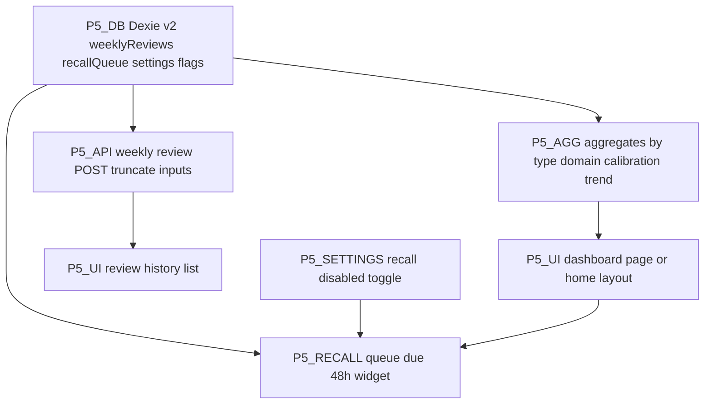

# Phase 5 - Implementation plan (Analytics Dashboard + Weekly Insights + Delayed Recall)

**Status:** Core Phase 5 implemented in `web/` (Dexie v2, dashboard metrics, weekly review API + UI, delayed recall queue + sidebar card, settings toggle). Track tweaks **here** only; do not use [`../ai_plan.txt`](../ai_plan.txt) as a live status board.

**Spec reference only:** [../ai_plan.txt](../ai_plan.txt) **Phase 5** (~841–917): **5.1** dashboard metrics, **5.2** weekly AI review (7 completed exercises trigger, token budget, inputs), **5.3** delayed recall sidebar widget + acceptance (~908–917).

**Prereqs:** Phases 1–4 complete; [`Exercise`](src/lib/types/exercise.ts) union covers all thinking types; [`completeExerciseFlow`](src/lib/db/complete-exercise.ts) persists exercise + journal + confidence + action; existing tables: [`schema.ts`](src/lib/db/schema.ts) `exercises`, `journalEntries`, `confidenceRecords`, `actions`, `decisions`, `settings`.

**AI model note:** ai_plan references **Claude Sonnet 4** for weekly review (~864). Repo uses **Gemini** ([`gemini.ts`](src/lib/ai/gemini.ts)) - Phase 5 ships on Gemini unless Anthropic is added later; document token limits against **Gemini** context instead of Sonnet pricing.

---

## Ordering principle

Build **types + Dexie migration → pure aggregations → dashboard UI (read-only charts)** → **weekly review payload builder + API + persistence + history** → **delayed recall queue + completion hook + sidebar widget + settings toggle**.

---

## P5-TYPES - New persisted rows

**Goal:** New TypeScript interfaces (e.g. under [`src/lib/types/`](src/lib/types/) or co-located with DB):

- **`WeeklyReviewRow`:** `id`, `createdAt`, `triggeredAtCompletedExerciseCount` (integer snapshot so “batch of 7” is auditable), `markdown` or structured `{ patterns, calibrationNote, blindSpot, suggestedFocus }` (prefer **plain markdown** first for simplicity), optional `modelId` string for debugging.
- **`DelayedRecallQueueRow`:** `id`, `exerciseId`, `exerciseTitle` snapshot, `completedAt` (ISO), `dueAt` (= completedAt + 48h), `status`: `"pending" | "answered" | "dismissed"`, `userAnswer` nullable, `feedbackText` nullable, `dismissedAt` nullable, `answeredAt` nullable.
- **Settings extension** ([`AppSettingsRow`](src/lib/db/schema.ts)): `delayedRecallEnabled?: boolean` (default true), `weeklyReviewLastCompletedCount?: number` (last count used to fire a review, to avoid duplicate triggers).

**Done when:** Types import cleanly in Dexie schema and API routes.

---

## P5-DB - Dexie version 2

**Goal:** [`src/lib/db/schema.ts`](src/lib/db/schema.ts) `version(2)` upgrade:

- New tables: `weeklyReviews`, `delayedRecallQueue` (names illustrative - pick final names and indexes: e.g. `dueAt`, `status`, `exerciseId`).
- Keep version 1 store definitions for existing tables unchanged where possible.
- Migration: `this.version(2).stores({ ... })` with upgrade handler if needed (usually not for additive stores).

**Done when:** Fresh DB and upgraded-from-v1 both open; no data loss on existing rows.

**Queue rules (5.3):** On each successful `completeExerciseFlow`, insert a **pending** recall row with `dueAt = completedAt + 48h` (use stable ISO math in UTC or document local-time choice). **Oldest pending** first when selecting widget row (`orderBy('dueAt')` among `status==='pending' && dueAt <= now`).

---

## P5-AGG - Dashboard metrics (5.1)

**Goal:** Pure module e.g. [`src/lib/analytics/dashboard-aggregates.ts`](src/lib/analytics/dashboard-aggregates.ts) (or extend [`analytics.ts`](src/lib/db/analytics.ts) stub):

1. **Total completed by type / domain:** `listCompletedExercises()` → `reduce` maps `Record<ThinkingType, number>` and `Record<domain, number>` (normalize domain string; cap list UI at top N + “Other”).
2. **Calibration trend:** reuse shape similar to [`history/page.tsx`](src/app/exercise/history/page.tsx) `GapChart` / `listConfidenceRecords()` - series `{ createdAt, gap }` or `{ t, confidenceBefore, actualAccuracy }` for a dual-line or gap-only line. Spec: “becoming better calibrated” → prefer **gap over time** (already defined in history UI copy).
3. **Domain distribution:** bar or simple sorted list from same completed exercise list.
4. **Blind spots panel (5.1 + 5.2):** **MVP:** render the **latest `WeeklyReviewRow` markdown** subsection (or whole card) under a “Blind spots / This week” heading. Optional later: separate lightweight journal-only API if product wants refresh between weekly runs.

**Done when:** Dashboard can render with empty states (no reviews yet, no exercises).

---

## P5-UI-DASH - Dashboard surface (5.1)

**Goal:** Dedicated route e.g. [`src/app/dashboard/page.tsx`](src/app/dashboard/page.tsx) **or** refactor [`HomeContent.tsx`](src/components/dashboard/HomeContent.tsx) into **layout with main column + narrow sidebar** for recall (5.3 requires sidebar, not blocking banner).

- Cards: totals by type, domain chart, calibration trend chart, latest weekly insight preview + link to full history.
- Navigation: add “Dashboard” link from home / header pattern consistent with existing [`/exercise/history`](src/app/exercise/history/page.tsx).

**Done when:** Acceptance: “meaningful trends” - at least non-vanity metrics listed above with honest empty states.

---

## P5-WEEKLY - Trigger + payload + API (5.2)

**Trigger logic (not calendar):**

- Let `C =` count of exercises with `completedAt != null` (same source as [`listCompletedExercises`](src/lib/db/exercises.ts)).
- Let `L = settings.weeklyReviewLastCompletedCount ?? 0`.
- When `C >= L + 7`, user is eligible for a **new** weekly review for the batch ending at `C` (define: review covers the **last 7 completed** exercises by `completedAt` desc, tie-break by `id`).
- After successful generation + save, set `weeklyReviewLastCompletedCount = C` (or `L + 7` if you need strict monotonicity - document one rule).

**Input assembly (strict truncation per spec ~866):**

- Last 7 exercises: for each, compact summary: `type`, `domain`, `title`, `completedAt`, **1–2 sentence** extract from `aiPerspective` or first N chars of scenario (constant `MAX_EX_SUMMARY_CHARS`).
- Matching `journalEntries` by `exerciseId`: concatenate `responses` with per-prompt cap (e.g. 200 chars each) → `MAX_JOURNAL_BLOB_PER_EXERCISE`.
- **Last 3** [`RealDecisionLogEntry`](src/lib/types/decision.ts): `text`, `domain`, boolean `followUpNoteFilled`, truncated.
- **Open actions** from last **14 days**: from [`actions`](src/lib/db/actions.ts) + join exercise title; include `oneAction`, latest `weeklyFollowThrough` note if any; truncate.

**API:** e.g. `POST /api/ai/weekly-review` - body built client-side **or** server loads from DB with user auth note: **today app is single-user local** - client sends pre-truncated payload OR server only accepts same-origin with session-less trust (document security stance for P5).

- Prompt file e.g. [`src/lib/ai/prompts/weekly-review.ts`](src/lib/ai/prompts/weekly-review.ts): enforce output sections matching spec (~868–876): patterns, calibration delta by domain, blind spot, suggested focus (thinking type + domain).
- Target **~2800 input / ~800 output** tokens: implement **character budgets** first (rough proxy), then tune after one real Gemini run.

**Persistence:** `weeklyReviews.put(row)`; **history UI:** extend [`history/page.tsx`](src/app/exercise/history/page.tsx) or new `/insights/history` - list past reviews with date + expandable markdown.

**Done when:** Completing 7th exercise in a dev session triggers one review; second trigger waits until count +7 again; no full-history dump in network tab for the prompt body.

---

## P5-RECALL - Delayed recall widget (5.3)

**Goal:** Non-blocking **sidebar card** on dashboard:

- Visible only if `delayedRecallEnabled !== false` and there exists **at most one** pending row with `dueAt <= now` (oldest first). Hide if none due.
- Copy: “Quick recall: [title] - 1 question…” + single textarea + submit + **X dismiss** (sets `dismissed`, never show again for that queue id).
- On answer: optional `POST /api/ai/recall-feedback` with original exercise summary + user recall line → brief comparison text (plain); store on row; **no penalty** if dismissed.

**Settings:** [`settings/page.tsx`](src/app/settings/page.tsx) - toggle “Enable delayed recall” bound to `AppSettingsRow`.

**Done when:** Max one widget; dismiss + disable flags respected; 48h rule verified with mocked `dueAt` in dev if needed.

---

## P5-QA - Acceptance vs spec (~908–917)

- [x] Dashboard: counts by type/domain + calibration trend + domain distribution.
- [x] Blind spots / weekly narrative surfaced (latest weekly markdown on dashboard).
- [x] Weekly review: every **7 completed** exercises (button when `count >= last+7`); stored + past list.
- [x] Inputs: last 7 exercises + journals + last 3 decisions + actions (14d), truncated in [`build-weekly-review-payload.ts`](src/lib/insights/build-weekly-review-payload.ts).
- [x] Delayed recall: sidebar card, 48h, dismiss, answer + `/api/ai/recall-feedback`, max one due row, settings toggle.
- [x] `npm run build` / `npm run lint`.

---

## Rủi ro & quyết định ghi trong ticket

- **Dexie upgrade testing:** Safari + Chrome; private window.
- **Double trigger:** guard with `weeklyReviewLastCompletedCount` + idempotent batch key.
- **Token creep:** hard caps per field; log **lengths only** server-side if debug needed (never full journal body).
- **Recall vs weekly:** separate prompts; recall must stay cheap (short output).

---

## Gợi ý commit milestones

1. `feat(db): dexie v2 weekly reviews and delayed recall queue plus settings flags`  
2. `feat(analytics): dashboard aggregates and calibration series helpers`  
3. `feat(ui): dashboard layout with metrics charts and weekly insight card`  
4. `feat(api): weekly review generation with truncated payload and history`  
5. `feat(ui): delayed recall sidebar widget and settings toggle`  
6. `chore: wire completeExerciseFlow to enqueue recall due at plus 48h`
